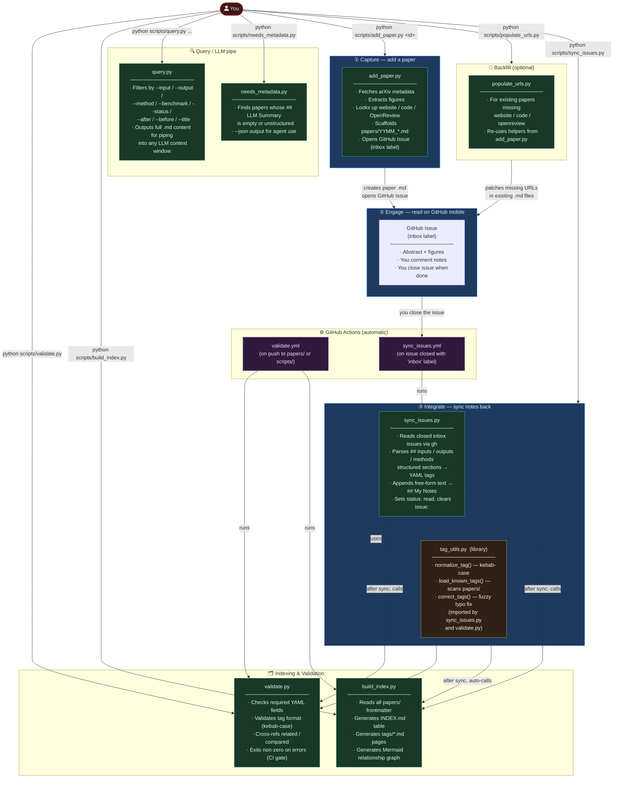

# Gaussian Splat Papers Knowledge Base

A structured, LLM-friendly knowledge base for Gaussian Splatting research papers — with a **GTD-style reading inbox** powered by GitHub Issues.

> **For LLM agents:** see [AGENT_GUIDE.md](AGENT_GUIDE.md) for the machine-facing workflow reference.

---

## Why

- **LLM-native**: Every paper is a self-contained `.md` file with YAML frontmatter — feed directly into any LLM as context
- **Git-synced**: A GitHub repo, works from any machine, no Notion dependency
- **Filterable**: Tag-based system for inputs, outputs, methods, and benchmarks
- **GTD inbox**: New papers land in your GitHub Issues feed so you can read on mobile — close the issue when done, notes sync back automatically

---

## GTD Reading Workflow

The knowledge base follows a three-phase Getting-Things-Done loop:

```
┌─────────────────────────────────────────────────────────┐
│  Phase 1 · CAPTURE                                      │
│  python scripts/add_paper.py <arxiv_id>                 │
│  → Creates papers/YYMM_<name>.md                        │
│  → Opens GitHub Issue [📥 Inbox] in your repo           │
└────────────────────┬────────────────────────────────────┘
                     │
                     ▼
┌─────────────────────────────────────────────────────────┐
│  Phase 2 · ENGAGE  (on GitHub mobile / web)             │
│  • Read abstract + figures in the issue                 │
│  • Leave comments with your thoughts                    │
│  • Close the issue when done reading                    │
└────────────────────┬────────────────────────────────────┘
                     │  (GitHub Actions triggers automatically)
                     ▼
┌─────────────────────────────────────────────────────────┐
│  Phase 3 · INTEGRATE                                    │
│  • Your comments → appended to ## My Notes              │
│  • status: to-read → status: read                       │
│  • INDEX.md + tag pages rebuilt automatically           │
└─────────────────────────────────────────────────────────┘
```

---

## Setup & Prerequisites

### 1. Python 3.10+

Required for all scripts. Install from [python.org](https://www.python.org/downloads/).

```bash
python --version   # should be 3.10 or newer
```

Optional dependency for better link extraction from PDFs:

```bash
pip install pypdf
```

### 2. GitHub CLI (`gh`)

Required for **Capture** (creating issues) and **local Integrate sync**.

**Install:**

| Platform | Command |
|---|---|
| Windows (winget) | `winget install --id GitHub.cli` |
| Windows (.exe) | See [cli.github.com](https://cli.github.com/) |
| macOS (brew) | `brew install gh` |
| Linux | See [cli.github.com/manual/installation](https://cli.github.com/manual/installation) |

**Authenticate:**

```bash
gh auth login
# Follow the prompts: choose GitHub.com → HTTPS → Authenticate Git with your GitHub credentials → Login with a web browser
```

**Verify:**

```bash
gh auth status
# Should show: ✓ Logged in to github.com as <your-username>
```

> **Note:** Without `gh`, the `add_paper.py` script still works — it will create the local `.md` file and print a warning instead of opening an issue. You can install `gh` later and re-run with `--force` to create the missing issue.

### 3. GitHub Actions — Allow Write Permissions

For the automatic **Integrate** phase (closing an issue → auto-commits notes back to `main`):

1. Go to your repo on GitHub → **Settings** → **Actions** → **General**
2. Under **Workflow permissions**, select **Read and write permissions**
3. Save

---

## Quick Start

### Capture a paper

```bash
python scripts/add_paper.py 2308.04079
python scripts/add_paper.py 2308.04079 --name 3d-gaussian-splatting --summary
python scripts/add_paper.py 2308.04079 --no-issue   # skip GitHub Issue creation
```

### Engage on mobile

Open the **GitHub** app → **Issues** tab in this repo. You'll see `[📥 Inbox] Paper Title`.

- Read the abstract and figures in the issue body
- Drop a comment with your thoughts
- Close the issue when you're done

### Integrate (automatic)

When you close an inbox issue, GitHub Actions automatically:

1. Copies your comments into `## My Notes` in the paper's `.md`
2. Sets `status: read`
3. Rebuilds the index
4. Commits the update to `main`

**Or sync manually:**

```bash
python scripts/sync_issues.py             # sync all closed inbox issues
python scripts/sync_issues.py --dry-run   # preview without writing
python scripts/sync_issues.py --issue 42  # sync a specific issue
```

---

## Adding Papers (Manual)

1. Copy `papers/_template.md` → `papers/YYMM_paper-name.md`
2. Fill in the YAML frontmatter (title, date, arxiv ID, tags, etc.)
3. Write or paste the `## LLM Summary` section
4. Add your notes under `## My Notes`
5. Run `python scripts/build_index.py` to regenerate the index

### File naming

Use `YYMM_kebab-case-short-title.md` — the `YYMM` prefix matches arXiv's submission month:

```
2308_3d-gaussian-splatting.md     ← arXiv 2308.04079
2311_mip-splatting.md             ← arXiv 2311.16493
2403_2d-gaussian-splatting.md     ← arXiv 2403.17888
```

---

## Feeding to an LLM

```bash
# Feed everything (small KB, ≤50 papers)
cat papers/*.md | llm "Compare regularization approaches in 3DGS papers..."

# Feed the index first, then drill down
cat INDEX.md | llm "Which papers handle single-image input?"

# Feed a filtered subset
python scripts/query.py --input multi-view-images --method 3dgs
python scripts/query.py --status read --benchmark mipnerf360
python scripts/query.py --author Kerbl --list
```

---

## Schema

Each paper file has **YAML frontmatter** for structured metadata and a **markdown body** for content.

### Required fields

| Field | Type | Example |
|---|---|---|
| `title` | string | `"3D Gaussian Splatting for Real-Time Radiance Field Rendering"` |
| `date` | date | `2023-08-08` |
| `arxiv` | string | `"2308.04079"` (quoted — prevents YAML float parsing) |
| `status` | enum | `read`, `skimmed`, or `to-read` |
| `inputs` | list | `[posed-multi-view-images, sfm-point-cloud]` |
| `outputs` | list | `[novel-view, 3d-gaussians]` |
| `methods` | list | `[3dgs, differentiable-rasterization]` |

### Optional fields

| Field | Type | Notes |
|---|---|---|
| `authors` | list | `[Bernhard Kerbl, George Drettakis]` |
| `venue` | string | `SIGGRAPH 2023` |
| `website` | URL | Project page |
| `code` | URL | GitHub/GitLab repository |
| `issue` | int | GitHub Issue number — managed automatically, cleared after sync |
| `benchmarks` | list | `[mipnerf360, tanks-and-temples]` |
| `related` | list | `[2311_mip-splatting]` (filenames without `.md`) |
| `compared` | list | `[2003_nerf, 2201_instant-ngp]` |

### Required sections

| Section | Purpose |
|---|---|
| `## LLM Summary` | LLM-generated paper summary (fixed heading for script targeting) |
| `## Results` | Benchmark results table (optional content) |
| `## My Notes` | Personal observations — comments from closed issues sync here |

---

## Tag System

Tags are **fine-grained by default**, with **broad filtering via prefix matching**.

```
Fine tag:     posed-multi-view-images
Broad match:  *multi-view-images  →  matches both "posed-" and "unposed-"
```

Tags are **open-ended** — add new ones as needed. `build_index.py` discovers all tags dynamically.

See [INDEX.md](INDEX.md) for the full tag listing and paper relationship graph.

---

## Scripts

### How the Scripts Relate



### Script Reference

| Script | When to run | What it does |
|---|---|---|
| `add_paper.py` | **Capture** — once per new paper | Fetches arXiv metadata, extracts figures, looks up website / code / OpenReview, scaffolds the `.md` file, opens a GitHub Issue |
| `populate_urls.py` | **Backfill** — on existing papers | Re-runs URL extraction for papers that are missing `website`, `code`, or `openreview` fields; imports helpers from `add_paper.py` |
| `sync_issues.py` | **Integrate** — after reading | Reads closed inbox issues via `gh`, parses structured `## inputs/outputs/methods` sections into YAML tags, appends free-form text to `## My Notes`, then auto-calls `validate.py` + `build_index.py` |
| `tag_utils.py` | *(library — not run directly)* | Shared tag normalisation (`normalize_tag`), known-tag loading (`load_known_tags`), and fuzzy typo correction (`correct_tags`); imported by `sync_issues.py` and `validate.py` |
| `validate.py` | **CI gate** + manual check | Validates frontmatter schema, tag kebab-case format, arXiv ID pattern, cross-references (`related`/`compared`); exits non-zero on errors |
| `build_index.py` | **After any paper change** | Reads all frontmatter, generates `INDEX.md` master table + per-tag pages under `tags/` + Mermaid relationship graph |
| `query.py` | **On-demand** — LLM workflows | Filters papers by input/output/method/benchmark/status/date/title; outputs full `.md` content for piping into an LLM |
| `needs_metadata.py` | **On-demand** — agent workflows | Lists papers whose `## LLM Summary` is empty or unstructured; use `--json` for agent-friendly output |

### Typical Invocations

```bash
# ── Capture ──────────────────────────────────────────────────────────
python scripts/add_paper.py 2308.04079               # basic capture
python scripts/add_paper.py 2308.04079 --summary     # also fetch alphaXiv summary
python scripts/add_paper.py 2308.04079 --no-issue    # skip GitHub Issue creation

# ── Backfill URLs for existing papers ────────────────────────────────
python scripts/populate_urls.py                      # all papers missing URLs
python scripts/populate_urls.py --no-pdf             # faster, skip PDF extraction

# ── Integrate (manual) ───────────────────────────────────────────────
python scripts/sync_issues.py                        # sync all closed inbox issues
python scripts/sync_issues.py --dry-run              # preview without writing
python scripts/sync_issues.py --issue 42             # sync one specific issue

# ── Validate & index ─────────────────────────────────────────────────
python scripts/validate.py                           # validate all papers
python scripts/build_index.py                        # regenerate INDEX.md + tags/

# ── Query / LLM pipe ─────────────────────────────────────────────────
python scripts/query.py --method 3dgs --status read
python scripts/query.py --input multi-view-images --list
python scripts/query.py --after 2024-01-01 | llm "Summarise these papers"

# ── Agent helpers ─────────────────────────────────────────────────────
python scripts/needs_metadata.py                     # show papers missing summaries
python scripts/needs_metadata.py --json              # JSON output for agent use
```

---

## Directory Structure

```
splat_papers/
├── README.md             ← human guide (this file)
├── AGENT_GUIDE.md        ← LLM agent guide
├── INDEX.md              ← auto-generated (table + graph)
├── papers/
│   ├── _template.md
│   ├── YYMM_paper-name.md
│   └── figures/          ← key architecture diagrams
├── tags/                 ← auto-generated
│   ├── input--tag-name.md
│   ├── output--tag-name.md
│   ├── method--tag-name.md
│   └── benchmark--tag-name.md
├── scripts/
│   ├── add_paper.py        ← CAPTURE phase
│   ├── populate_urls.py    ← backfill URLs for existing papers
│   ├── sync_issues.py      ← INTEGRATE phase (local)
│   ├── tag_utils.py        ← shared tag library (imported, not run directly)
│   ├── query.py            ← filter + pipe to LLM
│   ├── build_index.py      ← regenerate INDEX.md + tags/
│   ├── needs_metadata.py   ← find papers needing summaries
│   └── validate.py         ← schema validation (CI gate)
└── .github/
    └── workflows/
        ├── validate.yml      ← CI: validate + index check on push
        └── sync_issues.yml   ← CI: auto-integrate on issue close
```
